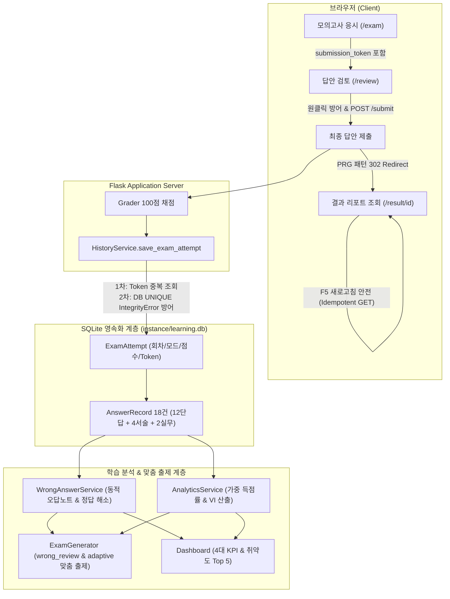

# Goal 3: CBT 학습기록 및 개인 학습 분석 기능 Final Baseline 확정 보고서

> **문서 버전**: v1.0.0 (Final)  
> **확정 일시**: 2026-10-03 23:55  
> **기준 Git 태그**: `v0.3-learning-analytics-final`  
> **종합 판정**: **FINAL BASELINE PASS (P0: 0건, P1: 0건, P2: 2건 Backlog)**  
> **전체 테스트 현황**: **102 / 102 ALL PASS (2.787s)**  

---

## 1. 개요 및 달성 성과

Goal 3에서는 Goal 2F에서 확정된 180문항 Final 문제은행의 100% 불변성을 보장하면서, **SQLite/SQLAlchemy 2.0 기반 응시 기록 영속화**, **동적 오답노트 집계**, **가중 득점률 및 취약도 지수(VI) 분석 엔진**, **취약/오답 맞춤형 시험 생성**, **통합 대시보드 UI**, 그리고 **POST /submit 멱등성 보장(Idempotency Token & PRG 패턴)**까지 전 과정을 성공적으로 완수하고 최종 베이스라인으로 고정합니다.



---

## 2. Goal 3 완료 기능 목록

| 기능 영역 | 주요 내용 | 엔드포인트 / 서비스 | 상태 |
|:---|:---|:---|:---:|
| **응시기록 영속화** | SQLite DB에 회차별 메타데이터, 점수(단답/서술/실무/총점), 합격여부, 18문항 답안 및 루브릭 채점 원자적 저장 | `HistoryService`, `instance/learning.db` | **완료** |
| **상세 복기 리포트** | 수험자 제출 답안, 정답/모범답안, 소문항 루브릭 매칭 피드백, 해설, 원본 PDF 출처/페이지 동적 결합 복기 | `GET /history/<id>`, `GET /result/<id>` | **완료** |
| **동적 오답노트** | `AnswerRecord` 최신 응시 상태 실시간 집계(비정규화 테이블 없음), 오답(`incorrect`/`partial`) 노출, 재응시 정답(`sufficient`) 시 자동 해소, 문항별 누적 시도 타임라인 | `GET /wrong-notes`, `GET /wrong-notes/<qid>` | **완료** |
| **학습 분석 엔진** | 문항 배점 가중 득점률 산출, 빈도 및 오답 비중을 반영한 취약도 지수($\text{VI}$) 알고리즘, 4단계 성취도 등급(`safe`/`warning`/`danger`/`none`) | `AnalyticsService` | **완료** |
| **취약/오답 맞춤 출제** | 100점 만점(18문항: 12/4/2, 실무 2택1) 준수, 오답 우선 출제(`mode=wrong_review`), VI 상위 개념 가중 출제(`mode=adaptive`), 0건 초기 상태 안전 Fallback | `mode=wrong_review`, `mode=adaptive` | **완료** |
| **통합 대시보드** | 4대 핵심 KPI(응시횟수, 평균점수, 합격률, 미해결 오답수), 5대 영역 가중 성취도, Top 5 취약 Concept 집중 클리닉, 최근 5회차 응시 추이 | `GET /dashboard` | **완료** |
| **중복 제출 방지 (Goal 3F-Fix)** | `secrets.token_urlsafe(32)` Idempotency Token 발급, DB UNIQUE 제약조건 및 Race condition 방어, PRG 패턴(302 Redirect), 결과 페이지 F5 안전성 확보 | `POST /submit` $\rightarrow$ `GET /result/<id>` | **완료** |

---

## 3. 데이터베이스 스키마 및 마이그레이션

### 3.1 테이블 구조
- **`exam_attempts`**:
  - `id` (INTEGER, PK, Autoincrement)
  - `submission_token` (VARCHAR(64), UNIQUE, INDEX, Nullable)
  - `exam_mode` (VARCHAR(50), NOT NULL)
  - `seed` (INTEGER, Nullable)
  - `started_at` (DATETIME, Nullable)
  - `submitted_at` (DATETIME, NOT NULL)
  - `duration_seconds` (INTEGER, Nullable)
  - `total_score` (FLOAT, NOT NULL)
  - `short_score` (FLOAT, NOT NULL)
  - `descriptive_score` (FLOAT, NOT NULL)
  - `practical_score` (FLOAT, NOT NULL)
  - `selected_practical_id` (VARCHAR(50), Nullable)
  - `is_passed` (BOOLEAN, NOT NULL)
  - `created_at` (DATETIME, INDEX, NOT NULL)
- **`answer_records`**:
  - `id` (INTEGER, PK, Autoincrement)
  - `attempt_id` (INTEGER, FK $\rightarrow$ `exam_attempts.id` ON DELETE CASCADE, INDEX)
  - `question_id` (VARCHAR(50), INDEX, NOT NULL)
  - `question_type` (VARCHAR(20), NOT NULL)
  - `user_answer` (TEXT, Nullable)
  - `earned_score` (FLOAT, NOT NULL)
  - `max_score` (FLOAT, NOT NULL)
  - `achievement_status` (VARCHAR(20), INDEX, NOT NULL) — `sufficient`, `partial`, `incorrect`, `unselected`
  - `is_correct` (BOOLEAN, NOT NULL)
  - `self_eval_data` (TEXT, Nullable)
  - `created_at` (DATETIME, INDEX, NOT NULL)
  - 복합 인덱스: `idx_answer_attempt_question`, `idx_answer_question_status`

### 3.2 안전 마이그레이션 및 기존 데이터 보존
- `init_db()` 내 `_migrate_schema()`를 통해 테이블 삭제(DROP) 없이 `ALTER TABLE exam_attempts ADD COLUMN submission_token VARCHAR(64)` 및 `CREATE UNIQUE INDEX`를 자동 수행.
- 기존 DB(`instance/learning.db`) 내 기존 19회차 Attempt 및 342건 AnswerRecord가 100% 완전 보존됨.

---

## 4. 전체 테스트 스위트 검증 결과 (102 / 102 ALL PASS)

```
Ran 102 tests in 2.787s
OK
```

| 범주 | 테스트 파일 | 테스트 수 | 결과 | 비고 |
|:---|:---|:---:|:---:|:---|
| **Goal 2 Regression** | `tests/test_loader.py` | 14 | **PASS** | 데이터셋 로딩 및 12개 Source 매핑 |
| | `tests/test_grader.py` | 24 | **PASS** | 단답/서술/실무 100점 채점 파이프라인 |
| | `tests/test_exam_generator.py` | 7 | **PASS** | 18문항 표준/랜덤 생성 및 Seed 재현성 |
| | `tests/test_routes.py` | 10 | **PASS** | 기본 웹 라우트 및 PRG 리다이렉트 연동 |
| | `tests/test_sources.py` | 4 | **PASS** | 12개 PDF Source 레지스트리 무결성 |
| | **Goal 2 소계** | **59** | **PASS** | 100% 하위 호환성 유지 |
| **Goal 3 Core Services** | `tests/test_history_persistence.py` | 5 | **PASS** | 응시기록 영속화 및 상세 복기 |
| | `tests/test_wrong_answer_service.py` | 4 | **PASS** | 동적 오답노트 및 정답 해소 라이프사이클 |
| | `tests/test_analytics.py` | 4 | **PASS** | 가중 득점률 및 VI 산출 알고리즘 |
| | `tests/test_adaptive_exam.py` | 4 | **PASS** | wrong_review 및 adaptive 맞춤 출제 |
| | `tests/test_dashboard_routes.py` | 2 | **PASS** | 대시보드 뷰 및 핵심 통계 렌더링 |
| **Goal 3 Integration QA** | `tests/test_goal3f_integration_qa.py` | 11 | **PASS** | DB 스키마 무결성, 실무형 1선택+1미선택, 캐스케이드 삭제 등 |
| | `tests/test_e2e_scenarios.py` | 3 | **PASS** | 3대 실사용자 라이프사이클 E2E |
| **Goal 3F-Fix Idempotency** | `tests/test_idempotency.py` | 10 | **PASS** | PRG 302, Double/Triple POST 중복방지, F5 새로고침, Race condition 방어 |
| **합계** | **전체 12개 테스트 파일** | **102** | **PASS** | **전체 PASS (0 Failures, 0 Errors)** |

---

## 5. 결함 등급 현황 (P0: 0건, P1: 0건, P2: 2건 Backlog)

- **P0 (치명적 결함)**: **0건** (모든 핵심 기능 및 DB 무결성 100% 안정)
- **P1 (중대 결함)**: **0건** (Goal 3F에서 지적된 `POST /submit` 중복 제출 취약점 완전 해결)
- **P2 (경미한 개선/Backlog)**: **2건 (유지)**
  1. *Walkthrough 문서 내 실무형 문항 설명 오기*: Goal 3F-Fix에서 "실무형 2문항 중 1문항 선택 + 1문항 미선택 (총 2건)"으로 정정 완료.
  2. *VI 취약도 지수의 Recency Weighting*: 미래 기능 개선 과제(Future Enhancement)로 백로그 등록.

---

## 6. 핵심 자산 암호학적 해시 (Cryptographic Integrity Hashes)

문제은행 불변성을 보증하기 위해 확정된 핵심 데이터의 SHA-256 체크섬을 기록합니다:

| 파일 경로 | 파일 크기 | SHA-256 Checksum | Goal 2 대비 일치 여부 |
|:---|:---:|:---|:---:|
| [`app/data/questions.json`](../app/data/questions.json) | 432,363 bytes | `661098ce80e957b033fbb1a2b540701815791169ecd57c0f367720b94f3d5dc9` | **100% 불변 일치** |
| [`app/data/concepts.json`](../app/data/concepts.json) | 11,678 bytes | `d33cdd63824c01c6537dd6f2cb6829b58bf121883a05eb406803bbe58bad5943` | **100% 불변 일치** |
| [`app/data/sources.json`](../app/data/sources.json) | 3,115 bytes | `9ae37ce41f1b3bccf0047474fca8e8332ad18f1ead298ee2f17fe85574049a21` | **100% 불변 일치** |

---

## 7. Git 태그 및 커밋 정보

- **커밋 메시지**: `feat: finalize Goal 3 learning analytics baseline`
- **Git 태그**: `v0.3-learning-analytics-final`
- **Goal 3 완료 판정**: **Goal 3 완전 종결 (Goal 4는 자동 시작하지 않음)**
